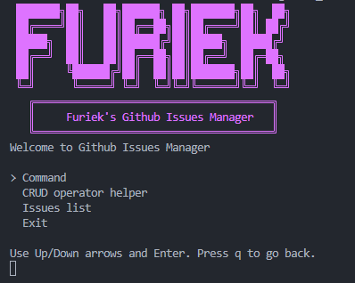
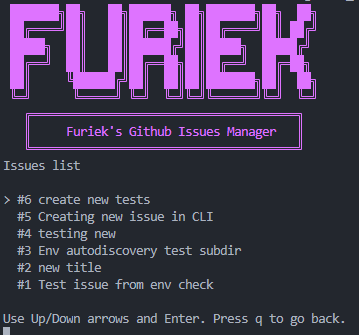
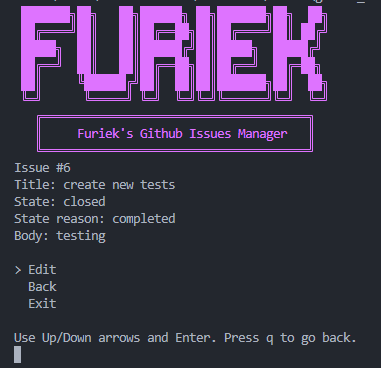
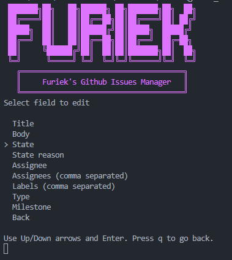

# GitHub Issues Manager

Interactive Go CLI to create and search GitHub issues.

## Project Structure

- `cmd`: CLI entrypoint (`main.go`)
- `internal/app`: interactive flow and action routing
- `internal/config`: environment configuration helpers
- `internal/githubapi`: GitHub REST API client and models

## Required Environment Variables

- `GITHUB_API_TOKEN`
- `GITHUB_OWNER`
- `GITHUB_REPO`
Use `.env.example` as a template.
The CLI auto-loads variables from `.env` in the project root.

PowerShell (current session) example:
```powershell
$env:GITHUB_API_TOKEN="ghp_xxx"
$env:GITHUB_OWNER="your-owner"
$env:GITHUB_REPO="your-repo"
```

## CLI screen captures
### Main Menu


### Issues list
#### Issues list view

#### Selected issue view

#### Edit issue view


## Run

```bash
go run ./cmd
```
